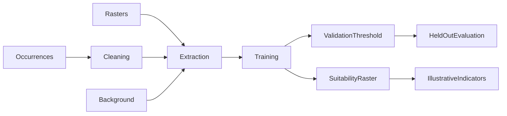

# pollinatorSDM

[](https://github.com/idrisslemnouni-crypto/pollinatorSDM/actions/workflows/R-CMD-check.yaml)

An experimental R package for pollinator habitat modelling and illustrative pollination indicators. The bundled demonstration is **synthetic**. No validated regional deficit, measured crop loss or field performance score is claimed.

## Problem and approach

Occurrence records and environmental rasters can support habitat analysis. This package provides acquisition helpers, spatial cleaning, background sampling, Random Forest classification, raster prediction and reporting. Habitat suitability and crop-dependency proxies require independent ecological evidence before informing a field decision.

## Architecture



Training, validation and test observations must be distinct. Fit correlation/VIF filtering only on the training partition and apply the resulting predictor names to the other partitions; `prepare_predictors()` cannot enforce this separation for callers.

## Installation

R >= 4.1 and spatial system dependencies for sf/terra are required. GitHub Actions checks the declared dependency set on its configured operating systems.

```r
install.packages("remotes")
remotes::install_github("idrisslemnouni-crypto/pollinatorSDM")
library(pollinatorSDM)
```

## Reproducible synthetic example

```r
source(system.file("examples", "spatial_demo.R", package = "pollinatorSDM"))
demo <- run_spatial_demo(seed = 42)
demo$metrics
demo$evaluation$roc_plot
```

The 900 generated grid cells are split into fixed west/central/east blocks before fitting. A validation-only Youden threshold is frozen for the final block. The ROC direction always treats larger predicted probabilities as occurrence: a poor model is not rescued by flipping the test-label direction. This checks the workflow, not biological validity. No copied or unverified numeric outputs are displayed.

For an existing fitted classifier:

```r
threshold <- select_sdm_threshold(model, validation_data)
result <- evaluate_models(model, test_data, threshold = threshold)
```

`evaluate_models()` defaults to a fixed 0.5 threshold. This intentionally replaces the former test-set Youden selection. Callers must update analyses that relied on that optimistic behaviour.

## Data and scientific limits

- Bundled pollinator coordinates are simulated, not GBIF observations.
- Bundled crop-dependency coefficients are illustrative literature summaries, without a row-level extraction audit. They are not field measurements.
- Acquisition helpers can call GBIF/geodata. Check source rights, attribution, units, coverage and failures before use; no externally acquired scientific benchmark is supplied here.
- The environmental downloader currently substitutes zero rasters for unavailable landcover layers. This fallback is explicitly announced and must be rejected or independently audited for a real study.
- Presence/background discrimination is not observed absence, abundance or calibrated pollination service. Recommendation and deficit class rules are heuristics.
- The existing background distance approximation assumes geographic coordinates; its projected-CRS limitations require correction before a real spatial study.
- No farm identities, independent Moroccan field dataset or ecological validation are available. Existing figures from the old synthetic example are not treated as scientific results.

## Project structure and tests

`R/` contains functions, `man/` their help pages, `data/` illustrative datasets, `inst/examples/` the seeded spatial example, `vignettes/` an executed demonstration and `tests/testthat/` meaningful regression checks.

```r
install.packages(c("devtools", "rcmdcheck"))
devtools::test()
rcmdcheck::rcmdcheck(args = "--no-manual", error_on = "warning")
```

Tests cover spatial cleaning and prediction, input validation, fixed-threshold evaluation, inverted-label ROC direction and disjoint demo partitions. The GitHub workflow builds the vignette and runs package checks. Its live result is available through the badge; no successful run is inferred from file presence.

## Next steps

Build a rights-cleared occurrence/environment manifest; audit units and source failures; fit preprocessing inside spatial training folds; validate background distances in a metric CRS; compare to ecological baselines and independent field observations.

## Author and licence

Idriss Lemnouni — engineering student in Data Science Applied to Agriculture, IAV Hassan II. Maintenance and documentation improvements are AI-assisted and reviewed through tests. Code: [MIT](LICENSE.md), with the R licence record in [LICENSE](LICENSE). Source data retain their own rights.
