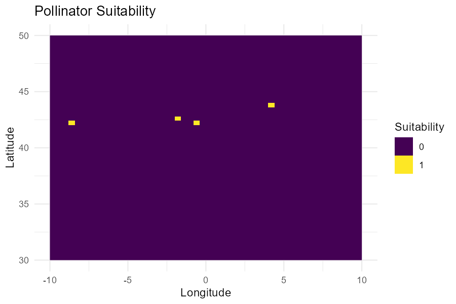

# pollinatorSDM

**pollinatorSDM** est un package R complet pour la modélisation de la distribution des pollinisateurs et l’évaluation des services de pollinisation.

## Installation

```r
devtools::install_github("idrisslemnouni-crypto/pollinatorSDM")
```

## Utilisation

```r
library(pollinatorSDM)

occ <- download_pollinator_data(limit = 50)
occ_clean <- clean_occurrences(occ)
env <- download_environmental_layers()
preds <- prepare_predictors(occ_clean, env)
bg <- generate_background_points(env, n = 1000)
bg$presence <- 0
model <- train_sdm_model(preds, bg)
pred <- predict_pollinator_distribution(model, env)
plot_pollinator_map(pred)
```

**Exemple de carte générée :**



## Fonctions principales

- **Acquisition** : `download_pollinator_data()`, `download_environmental_layers()`, `import_crop_data()`
- **Nettoyage** : `clean_occurrences()`, `prepare_predictors()`, `generate_background_points()`
- **Modélisation** : `train_sdm_model()`, `evaluate_models()`, `predict_pollinator_distribution()`
- **Analyse** : `calculate_pollination_index()`, `calculate_pollination_deficit()`, `analyze_landscape()`, `summarize_risk_by_region()`
- **Visualisation** : `plot_pollinator_map()`, `plot_pollination_deficit()`
- **Rapport** : `generate_recommendations()`, `generate_report()`

## Auteur

Idriss Lemnouni — Étudiant ingénieur, IAV Hassan II
